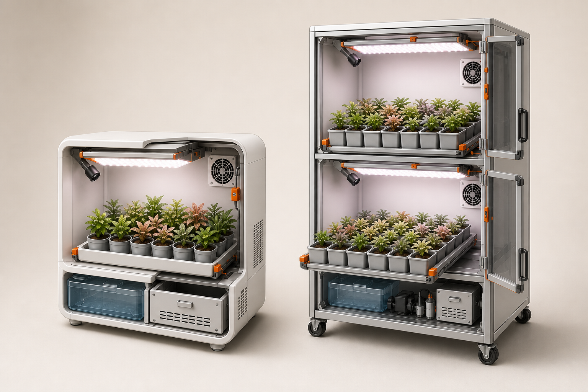

# SproutCam Build Kit

카메라와 환경 센서로 고가 식물의 발근·순화·성장을 기록하는 오픈 하드웨어 스마트 재배 캐비닛입니다.



## 제품군

| 모델 | 구조 | 대상 | 소매 시제품 예산 | 50대 목표 제조원가 |
|---|---:|---|---:|---:|
| HOME 12 | 1구역·12포트 | 개인 수집가·삽수 판매자 | 568,430원 | 399,100원/대 |
| PRO 48 | 2구역·48포트 | 소형 농가·판매점·육묘 작업자 | 1,419,240원 | 971,000원/대 |

금액은 2026-08-25 국내 소매 구매 기준 설계 예산입니다. 공구, 앱·서버 개발, 인증, 금형, 창고와 판매 수수료는 제외합니다.

## 바로 보기

- [HOME 12 + PRO 48 제품 제작서 PDF](output/pdf/SproutCam-HOME12-PRO48-제품제작서-v0.1.pdf)
- [HOME 12 BOM](docs/HOME12_BOM.csv)
- [PRO 48 BOM](docs/PRO48_BOM.csv)
- [프로파일·패널 절단표](docs/HOME_PRO_CUTLIST.csv)
- [HOME/PRO 고정구 CAD 생성기](cad/generate_home_pro.py)
- [HOME/PRO STL](output/stl/home-pro/)
- [HOME/PRO STEP](output/step/home-pro/)

## 설계 원칙

- 광원은 위, 식물은 아래에 둡니다.
- 병 전파를 줄이기 위해 공용 순환수조 대신 개별 화분과 탈착식 방수 트레이를 사용합니다.
- 캐비닛 전체는 출력하지 않습니다. 구조는 알루미늄 프로파일·판재·시판 트레이로 만들고, LED 클립·카메라 브래킷·센서 가드·케이블 클립·트레이 스토퍼만 PETG로 출력합니다.
- 제품은 광주기, 습도, 환기, 촬영과 누수 감지를 담당합니다. 냉난방은 실내 설치 환경이 담당합니다.
- 220V 변환은 KC 인증 외장 어댑터에서 끝내고 본체 내부에는 24V/5V DC만 넣습니다.

## HOME 12

- 외형: 560 W x 400 D x 600 H mm
- 2020 알루미늄 프로파일
- 4 x 3 배열의 12개 개별 화분
- 24V 30 W 풀스펙트럼 LED 바 2개
- XIAO ESP32-S3 Sense 카메라 1개
- SHT40, 팬 2개, 분리형 초음파 가습수조, 누수 센서
- KC 24V 5A 120 W 외장 어댑터

## PRO 48

- 외형: 680 W x 560 D x 1700 H mm
- 3030 알루미늄 프로파일과 브레이크 캐스터
- 24포트 독립 구역 2개
- 구역당 24V 40 W 풀스펙트럼 LED 바 2개
- 구역당 카메라·센서·팬·가습수조·제어기 1세트
- 구역당 KC 24V 150 W 이상 외장 어댑터
- 사용 중 상단을 벽체 또는 고정 구조물에 연결

## 제작 순서

1. BOM에서 트레이, 화분, LED와 프로파일을 먼저 구매합니다.
2. 실물 외경과 LED 단면을 측정합니다.
3. 절단표로 프로파일과 패널을 주문합니다.
4. `cad/generate_home_pro.py`의 치수를 확인하고 STL/STEP을 생성합니다.
5. 케이블 클립 한 개를 시험 출력해 프로파일 공차를 확인합니다.
6. 제작서 순서대로 건식 조립합니다.
7. 전자부품을 넣기 전에 24시간 누수 시험을 합니다.
8. 배선 후 누수 차단, 저수위 차단, 4시간 열 시험과 정전 복구 시험을 수행합니다.

CadQuery 실행 예시:

```bash
python3 -m venv .venv
source .venv/bin/activate
pip install cadquery
python cad/generate_home_pro.py
```

PDF 재생성 예시:

```bash
pip install reportlab
python tools/build_home_pro_manual.py
```

## SproutCam One v0.1

저장소에는 앞서 만든 2포트 탁상형 수경재배 실험기도 함께 들어 있습니다.

- [2포트 조립설명서 PDF](output/pdf/SproutCam-One-조립설명서.pdf)
- [기존 BOM](docs/BOM.csv)
- [기존 조립 안내](docs/ASSEMBLY.md)
- [기존 배선 안내](docs/WIRING.md)
- [기존 펌웨어](firmware/)

## 안전 및 판매 전 검토

이 저장소는 개발 시제품용입니다. 실제 판매 전에는 전파·전기·재료·내구·표시 의무에 대해 시험기관과 별도 검토가 필요합니다. 누전차단기가 있는 콘센트를 사용하고, 젖은 구역과 전자함을 분리하며, PRO 48에는 전도 방지 고정을 반드시 적용하십시오.
